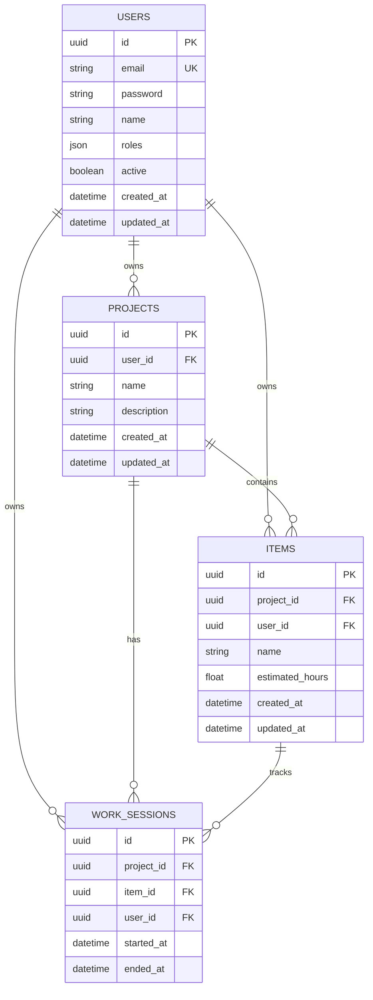

# HobbyPlanner

Aplicacion web para gestionar proyectos de hobby (pintura de miniaturas, modelismo, etc.). Permite planificar items, registrar sesiones de trabajo con un timer en tiempo real, y estimar fechas de finalizacion basadas en tu velocidad real.

## Stack

| Capa       | Tecnologia                                    |
|------------|------------------------------------------------|
| Frontend   | Vue 3 (Composition API) + Pinia + Vue Router + Tailwind CSS |
| Backend    | Symfony 6 + PHP 8.2 + Doctrine ORM            |
| Auth       | JWT (lexik/jwt-authentication-bundle)          |
| BD         | MySQL 8                                        |
| Infra      | Docker Compose (nginx + php-fpm + vue + mysql) |

## Arquitectura

El backend sigue **DDD (Domain-Driven Design)** con **arquitectura hexagonal**:

```
backend/src/
  Domain/           <- Entidades, Value Objects, interfaces de repositorio, excepciones
  Application/      <- Use Cases (casos de uso), DTOs
  Infrastructure/   <- Controllers, repositorios Doctrine, event listeners
```

### Principios aplicados (SOLID + Clean Code)

- **Single Responsibility**: cada Use Case hace una sola cosa
- **Open/Closed**: excepciones extensibles via jerarquia (`DomainException` -> `NotFoundException`, `ValidationException`)
- **Liskov Substitution**: repositorios intercambiables (Doctrine, in-memory para tests)
- **Interface Segregation**: interfaces de repositorio con metodos cohesivos por agregado
- **Dependency Inversion**: el dominio define interfaces (ports), la infraestructura implementa (adapters)
- **Value Objects**: IDs tipados (`ProjectId`, `ItemId`, etc.) con validacion UUID en `fromString()`
- **Domain Exceptions**: jerarquia mapeada automaticamente a HTTP por `ApiExceptionListener`

### Cascade de borrado en dominio (no en BD)

El borrado en cascada lo orquesta el **Use Case**, no los constraints de base de datos:

```
DeleteProjectUseCase:
  1. sessionRepository->deleteByProject()   <- Borra work sessions
  2. itemRepository->deleteByProject()       <- Borra items
  3. projectRepository->delete()             <- Borra proyecto

DeleteItemUseCase:
  1. sessionRepository->deleteByItem()       <- Borra work sessions
  2. itemRepository->delete()                <- Borra item
```

## Modelo de datos



## API Endpoints

### Auth
| Metodo | Ruta                | Descripcion          |
|--------|---------------------|----------------------|
| POST   | `/api/auth/login`   | Login (devuelve JWT) |
| POST   | `/api/auth/register`| Registro             |

### Projects
| Metodo | Ruta                          | Descripcion                    |
|--------|-------------------------------|--------------------------------|
| GET    | `/api/projects`               | Listar proyectos del usuario   |
| POST   | `/api/projects`               | Crear proyecto                 |
| GET    | `/api/projects/{id}`          | Detalle con items              |
| PUT    | `/api/projects/{id}`          | Actualizar proyecto            |
| DELETE | `/api/projects/{id}`          | Eliminar (cascade domain)      |
| GET    | `/api/projects/{id}/estimation` | Velocidad y estimacion       |

### Items
| Metodo | Ruta                     | Descripcion            |
|--------|--------------------------|------------------------|
| POST   | `/api/items`             | Crear item             |
| PUT    | `/api/items/{id}`        | Actualizar item        |
| DELETE | `/api/items/{id}`        | Eliminar (cascade)     |
| GET    | `/api/items/{id}/sessions` | Sesiones del item    |

### Work Sessions
| Metodo | Ruta                              | Descripcion          |
|--------|-----------------------------------|----------------------|
| POST   | `/api/work-sessions`              | Iniciar sesion       |
| PUT    | `/api/work-sessions/{id}/finish`  | Finalizar sesion     |
| PUT    | `/api/work-sessions/{id}`         | Editar sesion        |
| DELETE | `/api/work-sessions/{id}`         | Eliminar sesion      |

## Setup

### Requisitos

- Docker y Docker Compose

### Instalacion

```bash
# 1. Clonar el repositorio
git clone <url> hobbyplanner
cd hobbyplanner

# 2. Configurar secretos del backend
cp backend/.env backend/.env.local
# Editar backend/.env.local y poner valores reales:
#   APP_SECRET=<genera con: php -r "echo bin2hex(random_bytes(16));">
#   JWT_PASSPHRASE=<genera con: php -r "echo bin2hex(random_bytes(32));">

# 3. Levantar los contenedores
docker compose up -d --build

# 4. Instalar dependencias del backend
docker compose exec php composer install

# 5. Generar claves JWT
docker compose exec php bin/console lexik:jwt:generate-keypair

# 6. Crear la base de datos
docker compose exec php bin/console doctrine:migrations:migrate --no-interaction

# 7. Instalar dependencias del frontend (se hace automaticamente en el contenedor,
#    pero si quieres intellisense local en tu IDE):
cd frontend && npm install && cd ..
```

### Acceso

| Servicio     | URL                     |
|--------------|-------------------------|
| Frontend     | http://localhost:5173    |
| API (nginx)  | http://localhost/api     |
| phpMyAdmin   | http://localhost:8080    |

### Tests

```bash
# Backend
docker compose exec php bin/phpunit

# Frontend
docker compose exec vue npm test
```

## Estructura del frontend

```
frontend/src/
  api/           <- Cliente axios con interceptores JWT
  components/    <- Componentes Vue (items/, projects/, layout/, ui/)
  composables/   <- useBlockingAction, useToast
  layout/        <- AppLayout (NavBar + RouterView)
  stores/        <- Pinia stores (auth, project, timer)
  utils/         <- formatDate, formatHours
  views/         <- Vistas de ruta (Login, ProjectsList, ProjectDetail)
```

## Licencia

MIT
