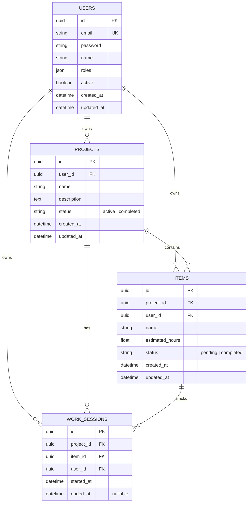

# HobbyPlanner

Aplicacion web para gestionar proyectos de hobby (pintura de miniaturas, modelismo, etc.). Permite planificar items, registrar sesiones de trabajo con un timer en tiempo real, gestionar un inventario global y estimar fechas de finalizacion basadas en tu velocidad real.

## Stack

| Capa       | Tecnologia                                    |
|------------|------------------------------------------------|
| Frontend   | Vue 3 (Composition API) + Pinia + Vue Router + Tailwind CSS |
| Backend    | Symfony 7.1 + PHP 8.2 + Doctrine ORM          |
| Auth       | JWT (lexik/jwt-authentication-bundle)          |
| BD         | MySQL 8                                        |
| Infra      | Docker Compose (nginx + php-fpm + vue + mysql) |

## Arquitectura

El backend sigue **DDD (Domain-Driven Design)** con **arquitectura hexagonal (Ports & Adapters)**:

```
backend/src/
  Domain/           <- Entidades, Value Objects, Enums, Repository Interfaces, Domain Services, Excepciones
  Application/      <- Use Cases (Request -> Response), DTOs
  Infrastructure/   <- Controllers, Repositorios Doctrine, Types, Event Listeners
```

### Principios aplicados (SOLID + Clean Code)

| Principio | Aplicacion en el proyecto |
|-----------|--------------------------|
| **S** — Single Responsibility | Cada Use Case hace una sola cosa. Controllers solo traducen HTTP <-> Use Case. DTOs encapsulan su serializacion (`toArray()`). |
| **O** — Open/Closed | Excepciones extensibles via jerarquia (`DomainException` -> `NotFoundException`, `ValidationException`). Nuevos IDs extienden `AbstractId`, nuevos types extienden `AbstractIdType`. |
| **L** — Liskov Substitution | `DoctrineProjectRepository` es intercambiable por un `InMemoryProjectRepository` en tests sin cambiar ningun Use Case. |
| **I** — Interface Segregation | Cada repositorio expone solo los metodos que su agregado necesita. Cada port define una sola responsabilidad. |
| **D** — Dependency Inversion | Use Cases dependen de ports (`PasswordHasherPort`, `TokenGeneratorPort`, `TransactionPort`, `CurrentUserProvider`), no de Symfony/Doctrine/Lexik. |

### Ports & Adapters

| Port (Application) | Adapter (Infrastructure) | Responsabilidad |
|---------------------|--------------------------|-----------------|
| `CurrentUserProvider` | `SymfonyCurrentUserProvider` | Obtener usuario autenticado |
| `PasswordHasherPort` | `SymfonyPasswordHasher` | Hashear/verificar passwords |
| `TokenGeneratorPort` | `LexikTokenGenerator` | Generar JWT |
| `TransactionPort` | `DoctrineTransactionManager` | Ejecutar transacciones |
| `*RepositoryInterface` | `Doctrine*Repository` | Persistencia |

**SecurityUser pattern**: la entidad `User` del dominio NO implementa interfaces de Symfony. Un adapter `SecurityUser` en infraestructura la envuelve para el sistema de seguridad.

### Value Objects e Inmutabilidad

- **IDs tipados**: `ProjectId`, `ItemId`, `UserId`, `WorkSessionId` — heredan de `AbstractId` (UUID v4 con `create()`, `fromString()`, `equals()`)
- **Email**: constructor privado, factory `fromString()`, validado con `filter_var`, inmutable
- **ProjectEstimation**: constructor privado, factory `create()` con validacion de rangos, inmutable
- **Enums como Value Objects**: `ItemStatus` (pending, completed) y `ProjectStatus` (active, completed) — PHP 8.2 backed enums, almacenados como strings en BD, sin tabla auxiliar

### Cascade de borrado en dominio (transaccional, no en BD)

El borrado en cascada lo orquesta el **Use Case** dentro de una **transaccion** (`TransactionPort`), no los constraints de base de datos:

```
DeleteProjectUseCase (transactional):
  1. sessionRepository->deleteByProject()   <- Borra work sessions
  2. itemRepository->deleteByProject()       <- Borra items
  3. projectRepository->delete()             <- Borra proyecto

DeleteItemUseCase (transactional):
  1. sessionRepository->deleteByItem()       <- Borra work sessions
  2. itemRepository->delete()                <- Borra item
```

Si cualquier paso falla, la transaccion hace rollback — sin registros huerfanos.

## Modelo de datos



### Foreign Keys e Indices

| Tabla | Foreign Keys | Indices |
|-------|-------------|---------|
| `users` | — | `uniq_users_email` (UNIQUE) |
| `projects` | `user_id -> users(id) CASCADE` | `idx_projects_user_id` |
| `items` | `project_id -> projects(id) CASCADE`, `user_id -> users(id) CASCADE` | `idx_items_project_id`, `idx_items_user_id`, `idx_items_status` |
| `work_sessions` | `project_id -> projects(id) CASCADE`, `item_id -> items(id) CASCADE`, `user_id -> users(id) CASCADE` | `idx_work_sessions_user_id`, `idx_work_sessions_project_id`, `idx_work_sessions_item_id` |

## API Endpoints

### Auth
| Metodo | Ruta                 | Descripcion          |
|--------|----------------------|----------------------|
| POST   | `/api/auth/login`    | Login (devuelve JWT) |
| POST   | `/api/auth/register` | Registro             |

### Projects
| Metodo | Ruta                              | Descripcion                    |
|--------|-----------------------------------|--------------------------------|
| GET    | `/api/projects`                   | Listar proyectos del usuario   |
| POST   | `/api/projects`                   | Crear proyecto                 |
| GET    | `/api/projects/{id}`              | Detalle con items (admite `?sortBy=name\|estimatedHours\|status&direction=asc\|desc`, vía `ItemSortField`/`SortDirection` + Doctrine QueryBuilder) |
| PUT    | `/api/projects/{id}`              | Actualizar proyecto            |
| DELETE | `/api/projects/{id}`              | Eliminar (cascade domain)      |
| PUT    | `/api/projects/{id}/toggle-status`| Alternar active <-> completed  |
| GET    | `/api/projects/{id}/estimation`   | Velocidad y estimacion         |

### Items
| Metodo | Ruta                          | Descripcion                         |
|--------|-------------------------------|-------------------------------------|
| POST   | `/api/items`                  | Crear item                          |
| PUT    | `/api/items/{id}`             | Actualizar item                     |
| DELETE | `/api/items/{id}`             | Eliminar (cascade)                  |
| PUT    | `/api/items/{id}/toggle-status`| Alternar pending <-> completed     |
| GET    | `/api/items/{id}/sessions`    | Sesiones del item                   |

### Work Sessions
| Metodo | Ruta                              | Descripcion          |
|--------|-----------------------------------|----------------------|
| POST   | `/api/work-sessions`              | Iniciar sesion       |
| PUT    | `/api/work-sessions/{id}/finish`  | Finalizar sesion     |
| PUT    | `/api/work-sessions/{id}`         | Editar sesion        |
| DELETE | `/api/work-sessions/{id}`         | Eliminar sesion      |

### Inventario
| Metodo | Ruta             | Descripcion                                 |
|--------|------------------|---------------------------------------------|
| GET    | `/api/inventory` | Todos los items del usuario con su proyecto  |

### Health (publico, no requiere JWT)
| Metodo | Ruta          | Descripcion    |
|--------|---------------|----------------|
| GET    | `/api/health` | Health check   |

## Setup

### Requisitos

- Docker y Docker Compose

> **Nota de seguridad**: las credenciales en `docker-compose.yml` y `backend/.env` son exclusivamente para desarrollo local. Los secretos reales se configuran en `backend/.env.local` (no incluido en el repositorio).

### Instalacion

```bash
# 1. Clonar el repositorio
git clone <url> hobbyplanner
cd hobbyplanner

# 2. Configurar secretos del backend
cp backend/.env backend/.env.local
# Editar backend/.env.local y poner valores reales:
#   APP_SECRET=<genera con: php -r "echo bin2hex(random_bytes(16));">
#   JWT_PASSPHRASE=<genera con: php -r "echo bin2hex(random_bytes(32));">

# 3. Levantar los contenedores
docker compose up -d --build

# 4. Instalar dependencias del backend
docker compose exec php composer install

# 5. Generar claves JWT
docker compose exec php bin/console lexik:jwt:generate-keypair

# 6. Ejecutar migraciones (crea todas las tablas con FK e indices)
docker compose exec php bin/console doctrine:migrations:migrate --no-interaction

# 7. Instalar dependencias del frontend (se hace automaticamente en el contenedor,
#    pero si quieres intellisense local en tu IDE):
cd frontend && npm install && cd ..
```

### Acceso

| Servicio     | URL                     |
|--------------|-------------------------|
| Frontend     | http://localhost:5173    |
| API (nginx)  | http://localhost/api     |
| phpMyAdmin   | http://localhost:8080    |

### Rendimiento en Windows — usa WSL2, no `C:\`

Si desarrollas en Windows con Docker Desktop y clonaste el repo en una ruta de tipo `C:\...`, Symfony en modo dev va a ir **extremadamente lento** (arranques de 10+ segundos, peticiones de varios segundos). No es un problema de este proyecto ni de PHP: Docker Desktop en Windows ejecuta los contenedores Linux dentro de una VM (WSL2), y cuando montas una carpeta de `C:\` como bind mount, **cada acceso a fichero cruza la frontera Windows↔Linux** via el protocolo 9P. Symfony en dev abre miles de ficheros pequeños por request (autoload, contenedor DI, mappings de Doctrine...), y esa frontera cobra unos milisegundos por cada uno.

Numeros reales medidos en este proyecto (`php bin/console about`, sin logica de negocio):

| Ubicacion del codigo                          | Arranque Symfony | Peticion HTTP real | Suite de tests completa |
|------------------------------------------------|------------------|---------------------|--------------------------|
| `C:\workspace\...` (bind mount Windows)        | 12–14 s          | 3.8–11 s (inestable)| ~9.4 s                   |
| Filesystem nativo de WSL2 (`~/...` en Ubuntu)  | 0.07–0.08 s      | ~0.5 s (estable)    | ~70 ms                   |

**Solucion — trabaja desde dentro de WSL2, no desde `C:\`:**

```bash
# 1. Copia el repo al filesystem nativo de tu distro WSL2 (una sola vez)
#    Desde una terminal de Ubuntu/WSL:
rsync -a --exclude 'backend/vendor/' --exclude 'backend/var/' \
         --exclude 'frontend/node_modules/' --exclude 'frontend/dist/' \
         /mnt/c/ruta/a/hobbyplanner_from_git/ ~/hobbyplanner_from_git/

# 2. Docker Desktop -> Settings -> Resources -> WSL Integration
#    Activa el toggle de tu distro (p.ej. "Ubuntu") -> Apply & Restart
#    (si Docker Desktop se queda raro tras el restart, cierra TODOS los
#    procesos "Docker Desktop"/"com.docker.*" y `wsl --shutdown` antes
#    de relanzarlo una sola vez — evita instancias duplicadas)

# 3. Trabaja siempre desde dentro de WSL2 a partir de aqui
cd ~/hobbyplanner_from_git
code .                          # abre VS Code en modo "WSL: Ubuntu"
docker compose up -d --build
docker compose exec php composer install
```

El nombre del proyecto de Docker Compose se calcula del nombre de carpeta — si la mantienes igual (`hobbyplanner_from_git`), reutiliza automaticamente los volumenes (`_db_data`, `_node_modules`) que ya tuvieras en `C:\`, sin perder datos.

Aparte de esto, `docker/php/Dockerfile` ya trae un ajuste de opcache (`revalidate_freq`, `realpath_cache`) que ayuda un poco incluso sobre bind mount — pero es un parche menor comparado con quitar la frontera Windows↔Linux del todo.

### Tests

```bash
# Backend — unit tests
docker compose exec php bin/phpunit

# Backend — con descripcion legible
docker compose exec php bin/phpunit --testdox

# Frontend
docker compose exec vue npm test
```

## Estructura del proyecto

### Backend

```
backend/src/
  Domain/
    Entity/               Item, Project, User, WorkSession
    ValueObject/          ItemId, ProjectId, UserId, Email, ItemStatus, ProjectStatus, ProjectEstimation
    Repository/           *RepositoryInterface (ports)
    Service/              ProjectEstimator
    Security/             OwnableResource (interfaz que implementan las entidades)
    Exception/            DomainException, NotFoundException, ValidationException, AuthenticationException, AccessDeniedException...
  Application/
    UseCase/
      Auth/Login/         LoginUseCase
      User/CreateUser/    CreateUserUseCase
      Project/            Create, Update, Delete, List, GetWithItems, GetEstimation, ToggleStatus
      Item/               Create, Update, Delete, GetSessions, ToggleStatus
      WorkSession/        Start, Finish, Update, Delete
      Inventory/          ListInventory
    DTO/                  ProjectDTO, ItemDTO, WorkSessionDTO, ProjectEstimationDTO (cada uno con toArray())
    Port/                 CurrentUserProvider, PasswordHasherPort, TokenGeneratorPort, TransactionPort
    Security/             OwnershipGuard (verifica que el recurso es del usuario)
  Infrastructure/
    Controller/Api/       AuthController, ProjectController, ItemController, WorkSessionController, InventoryController
    Persistence/Doctrine/
      Repository/         DoctrineProjectRepository, DoctrineItemRepository...
      Type/               UserIdType, ProjectIdType, ItemIdType, EmailType...
    EventListener/        ApiExceptionListener
    Security/             SecurityUser (adapter), SecurityUserProvider, SymfonyCurrentUserProvider, SymfonyPasswordHasher, LexikTokenGenerator
    Persistence/Doctrine/ DoctrineTransactionManager (TransactionPort adapter)
```

### Frontend

```
frontend/src/
  api/                    Capa servicios API: axios.ts + projectApi, itemApi, sessionApi, inventoryApi, authApi
  auth/                   TokenIntrospector (decode JWT client-side, detectar expiracion proactiva)
  types/                  Tipos centralizados: Project, Item, Session, Estimation, InventoryItem
  components/
    items/                ItemsTable, ItemRow, CreateItemModal, SessionsModal
    projects/             ProjectCard, CreateProjectModal, ProjectEstimationCard
    layout/               NavBar (timer global, user menu, logout)
    ui/                   ToastContainer, BlockingOverlay
  composables/            useBlockingAction, useToast
  layout/                 AppLayout
  stores/                 authStore, projectStore, timerStore
  utils/                  formatDate, formatHours
  views/
    LoginView             Login y registro
    projects/             ProjectsListView, ProjectDetailView
    inventory/            InventoryView
  router/                 Rutas con guard de autenticacion
```

## Funcionalidades

### Gestion de proyectos
- CRUD completo de proyectos
- Estado de proyecto: activo / completado (toggle reversible)
- Badge visual para proyectos completados

### Items y estimacion
- CRUD de items con horas estimadas
- Estado de item: pendiente / completado (toggle con confirmacion)
- Confirmacion inline antes de completar ("¿Completar? Si / No")
- Items completados: opacidad reducida, texto tachado, timer deshabilitado
- **Ordenacion por columna** (Nombre, Horas estimadas, Estado): click en la cabecera ordena asc/desc contra la BD (Doctrine `QueryBuilder`, whitelist via enum `ItemSortField` — no se puede inyectar una columna arbitraria)
- **Seleccion multiple y borrado masivo**: checkbox por fila + "seleccionar todo" en cabecera (estado indeterminado si la seleccion es parcial), barra de accion contextual con confirmacion antes de eliminar

### Sistema de estimacion (ProjectEstimator)
- **Velocidad**: horas trabajadas / dias activos
- **Frecuencia**: dias activos / semanas desde inicio
- **Restante**: solo cuenta items pendientes y sus horas trabajadas (items completados se excluyen correctamente sin doble conteo)
- **Fecha estimada**: proyecta la finalizacion basandose en velocidad y frecuencia

### Timer en tiempo real
- Timer global visible en NavBar
- Solo una sesion activa por usuario (validado en backend)
- Persistencia: se restaura al recargar la pagina
- Confirmacion antes de iniciar y parar

### Inventario
- Vista global de todos los items del usuario en todos los proyectos
- Filtros: Todos, Pendientes, Completados
- Toggle de estado con confirmacion
- Link a cada proyecto

### Autenticacion y Seguridad
- Registro y login con JWT (TTL 8 horas, firma RSA)
- Token en localStorage con interceptor Axios (automatico en cada request)
- `TokenIntrospector`: detecta token expirado client-side antes de enviar peticion
- Redireccion automatica a /login en 401 o token expirado
- Logout desde menu de usuario en NavBar
- **OwnershipGuard**: cada operacion sobre un recurso existente verifica que pertenece al usuario autenticado
- Excepciones de dominio mapeadas a HTTP: AuthenticationException (401), AccessDeniedException (403)
- Filtrado por usuario en repositorios: un usuario nunca puede ver datos de otro

## Autor

Adrián González Romero

## Licencia

MIT
