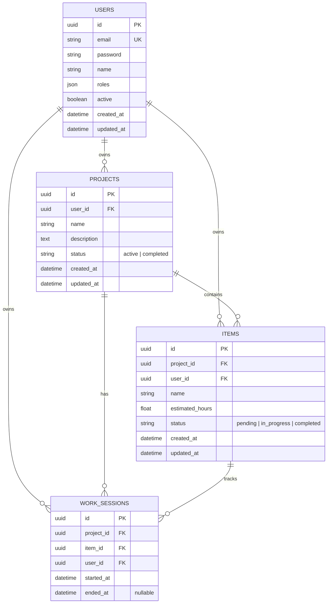

# HobbyPlanner

Aplicacion web para gestionar proyectos de hobby (pintura de miniaturas, modelismo, etc.). Permite planificar items, registrar sesiones de trabajo con un timer en tiempo real, gestionar un inventario global y estimar fechas de finalizacion basadas en tu velocidad real.

## Stack

| Capa       | Tecnologia                                    |
|------------|------------------------------------------------|
| Frontend   | Vue 3 (Composition API) + Pinia + Vue Router + Tailwind CSS |
| Backend    | Symfony 7.1 + PHP 8.2 + Doctrine ORM          |
| Auth       | JWT (lexik/jwt-authentication-bundle)          |
| BD         | MySQL 8                                        |
| Infra      | Docker Compose (nginx + php-fpm + vue + mysql) |

## Arquitectura

El backend sigue **DDD (Domain-Driven Design)** con **arquitectura hexagonal (Ports & Adapters)**:

```
backend/src/
  Domain/           <- Entidades, Value Objects, Enums, Repository Interfaces, Domain Services, Excepciones
  Application/      <- Use Cases (Request -> Response), DTOs
  Infrastructure/   <- Controllers, Repositorios Doctrine, Types, Event Listeners
```

### Principios aplicados (SOLID + Clean Code)

| Principio | Aplicacion en el proyecto |
|-----------|--------------------------|
| **S** — Single Responsibility | Cada Use Case hace una sola cosa. Controllers solo traducen HTTP <-> Use Case. |
| **O** — Open/Closed | Excepciones extensibles via jerarquia (`DomainException` -> `NotFoundException`, `ValidationException`). Nuevos estados como PHP enums sin modificar logica existente. |
| **L** — Liskov Substitution | `DoctrineProjectRepository` es intercambiable por un `InMemoryProjectRepository` en tests sin cambiar ningun Use Case. |
| **I** — Interface Segregation | Cada repositorio expone solo los metodos que su agregado necesita. |
| **D** — Dependency Inversion | Use Cases dependen de `ProjectRepositoryInterface` (puerto del dominio), no de `DoctrineProjectRepository` (adaptador de infraestructura). |

### Value Objects e Inmutabilidad

- **IDs tipados**: `ProjectId`, `ItemId`, `UserId`, `WorkSessionId` — UUID v4 con `create()`, `fromString()`, `equals()`
- **Email**: validado con `filter_var`, inmutable
- **ProjectEstimation**: VO inmutable con todos los datos de estimacion
- **Enums como Value Objects**: `ItemStatus` (pending, in_progress, completed) y `ProjectStatus` (active, completed) — PHP 8.2 backed enums, almacenados como strings en BD, sin tabla auxiliar

### Cascade de borrado en dominio (no en BD)

El borrado en cascada lo orquesta el **Use Case**, no los constraints de base de datos:

```
DeleteProjectUseCase:
  1. sessionRepository->deleteByProject()   <- Borra work sessions
  2. itemRepository->deleteByProject()       <- Borra items
  3. projectRepository->delete()             <- Borra proyecto

DeleteItemUseCase:
  1. sessionRepository->deleteByItem()       <- Borra work sessions
  2. itemRepository->delete()                <- Borra item
```

## Modelo de datos



### Foreign Keys e Indices

| Tabla | Foreign Keys | Indices |
|-------|-------------|---------|
| `users` | — | `uniq_users_email` (UNIQUE) |
| `projects` | `user_id -> users(id) CASCADE` | `idx_projects_user_id` |
| `items` | `project_id -> projects(id) CASCADE`, `user_id -> users(id) CASCADE` | `idx_items_project_id`, `idx_items_user_id`, `idx_items_status` |
| `work_sessions` | `project_id -> projects(id) CASCADE`, `item_id -> items(id) CASCADE`, `user_id -> users(id) CASCADE` | `idx_work_sessions_project_id`, `idx_work_sessions_item_id`, `idx_work_sessions_user_id` |

## API Endpoints

### Auth
| Metodo | Ruta                 | Descripcion          |
|--------|----------------------|----------------------|
| POST   | `/api/auth/login`    | Login (devuelve JWT) |
| POST   | `/api/auth/register` | Registro             |

### Projects
| Metodo | Ruta                              | Descripcion                    |
|--------|-----------------------------------|--------------------------------|
| GET    | `/api/projects`                   | Listar proyectos del usuario   |
| POST   | `/api/projects`                   | Crear proyecto                 |
| GET    | `/api/projects/{id}`              | Detalle con items              |
| PUT    | `/api/projects/{id}`              | Actualizar proyecto            |
| DELETE | `/api/projects/{id}`              | Eliminar (cascade domain)      |
| PUT    | `/api/projects/{id}/toggle-status`| Alternar active <-> completed  |
| GET    | `/api/projects/{id}/estimation`   | Velocidad y estimacion         |

### Items
| Metodo | Ruta                          | Descripcion                         |
|--------|-------------------------------|-------------------------------------|
| POST   | `/api/items`                  | Crear item                          |
| PUT    | `/api/items/{id}`             | Actualizar item                     |
| DELETE | `/api/items/{id}`             | Eliminar (cascade)                  |
| PUT    | `/api/items/{id}/toggle-status`| Alternar pending <-> completed     |
| GET    | `/api/items/{id}/sessions`    | Sesiones del item                   |

### Work Sessions
| Metodo | Ruta                              | Descripcion          |
|--------|-----------------------------------|----------------------|
| POST   | `/api/work-sessions`              | Iniciar sesion       |
| PUT    | `/api/work-sessions/{id}/finish`  | Finalizar sesion     |
| PUT    | `/api/work-sessions/{id}`         | Editar sesion        |
| DELETE | `/api/work-sessions/{id}`         | Eliminar sesion      |

### Inventario
| Metodo | Ruta             | Descripcion                                 |
|--------|------------------|---------------------------------------------|
| GET    | `/api/inventory` | Todos los items del usuario con su proyecto  |

### Health
| Metodo | Ruta          | Descripcion    |
|--------|---------------|----------------|
| GET    | `/api/health` | Health check   |

## Setup

### Requisitos

- Docker y Docker Compose

### Instalacion

```bash
# 1. Clonar el repositorio
git clone <url> hobbyplanner
cd hobbyplanner

# 2. Configurar secretos del backend
cp backend/.env backend/.env.local
# Editar backend/.env.local y poner valores reales:
#   APP_SECRET=<genera con: php -r "echo bin2hex(random_bytes(16));">
#   JWT_PASSPHRASE=<genera con: php -r "echo bin2hex(random_bytes(32));">

# 3. Levantar los contenedores
docker compose up -d --build

# 4. Instalar dependencias del backend
docker compose exec php composer install

# 5. Generar claves JWT
docker compose exec php bin/console lexik:jwt:generate-keypair

# 6. Ejecutar migraciones (crea todas las tablas con FK e indices)
docker compose exec php bin/console doctrine:migrations:migrate --no-interaction

# 7. Instalar dependencias del frontend (se hace automaticamente en el contenedor,
#    pero si quieres intellisense local en tu IDE):
cd frontend && npm install && cd ..
```

### Acceso

| Servicio     | URL                     |
|--------------|-------------------------|
| Frontend     | http://localhost:5173    |
| API (nginx)  | http://localhost/api     |
| phpMyAdmin   | http://localhost:8080    |

### Tests

```bash
# Backend — unit tests
docker compose exec php bin/phpunit

# Backend — con descripcion legible
docker compose exec php bin/phpunit --testdox

# Frontend
docker compose exec vue npm test
```

## Estructura del proyecto

### Backend

```
backend/src/
  Domain/
    Entity/               Item, Project, User, WorkSession
    ValueObject/          ItemId, ProjectId, UserId, Email, ItemStatus, ProjectStatus, ProjectEstimation
    Repository/           *RepositoryInterface (ports)
    Service/              ProjectEstimator
    Exception/            DomainException, NotFoundException, ValidationException...
  Application/
    UseCase/
      Auth/Login/         LoginUseCase
      User/CreateUser/    CreateUserUseCase
      Project/            Create, Update, Delete, List, GetWithItems, GetEstimation, ToggleStatus
      Item/               Create, Update, Delete, GetSessions, ToggleStatus
      WorkSession/        Start, Finish, Update, Delete
      Inventory/          ListInventory
    DTO/                  ProjectDTO, ItemDTO, WorkSessionDTO, ProjectEstimationDTO
  Infrastructure/
    Controller/Api/       AuthController, ProjectController, ItemController, WorkSessionController, InventoryController
    Persistence/Doctrine/
      Repository/         DoctrineProjectRepository, DoctrineItemRepository...
      Type/               UserIdType, ProjectIdType, ItemIdType, EmailType...
    EventListener/        ApiExceptionListener
```

### Frontend

```
frontend/src/
  api/                    Axios instance con interceptor JWT
  components/
    items/                ItemsTable, ItemRow, CreateItemModal, SessionsModal
    projects/             ProjectCard, CreateProjectModal, ProjectEstimationCard
    layout/               NavBar (timer global, user menu, logout)
    ui/                   ToastContainer, BlockingOverlay
  composables/            useBlockingAction, useToast
  layout/                 AppLayout
  stores/                 authStore, projectStore, timerStore
  utils/                  formatDate, formatHours
  views/
    LoginView             Login y registro
    projects/             ProjectsListView, ProjectDetailView
    inventory/            InventoryView
  router/                 Rutas con guard de autenticacion
```

## Funcionalidades

### Gestion de proyectos
- CRUD completo de proyectos
- Estado de proyecto: activo / completado (toggle reversible)
- Badge visual para proyectos completados

### Items y estimacion
- CRUD de items con horas estimadas
- Estado de item: pendiente / en progreso / completado (toggle con confirmacion)
- Confirmacion inline antes de completar ("¿Completar? Si / No")
- Items completados: opacidad reducida, texto tachado, timer deshabilitado

### Sistema de estimacion (ProjectEstimator)
- **Velocidad**: horas trabajadas / dias activos
- **Frecuencia**: dias activos / semanas desde inicio
- **Restante**: solo cuenta items pendientes y sus horas trabajadas (items completados se excluyen correctamente sin doble conteo)
- **Fecha estimada**: proyecta la finalizacion basandose en velocidad y frecuencia

### Timer en tiempo real
- Timer global visible en NavBar
- Solo una sesion activa por usuario (validado en backend)
- Persistencia: se restaura al recargar la pagina
- Confirmacion antes de iniciar y parar

### Inventario
- Vista global de todos los items del usuario en todos los proyectos
- Filtros: Todos, Pendientes, En progreso, Completados
- Toggle de estado con confirmacion
- Link a cada proyecto

### Autenticacion
- Registro y login con JWT
- Token en localStorage con interceptor Axios
- Redireccion automatica a /login en 401
- Logout desde menu de usuario en NavBar

## Licencia

MIT
