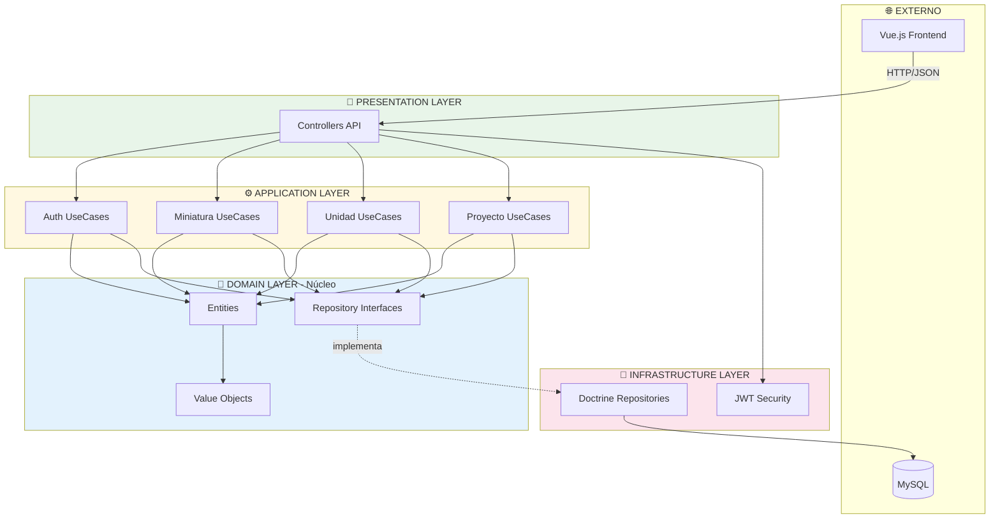
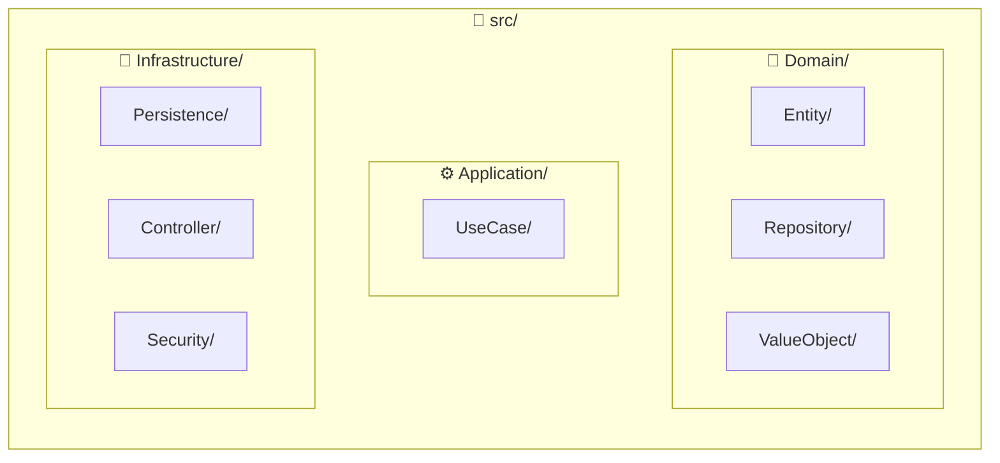
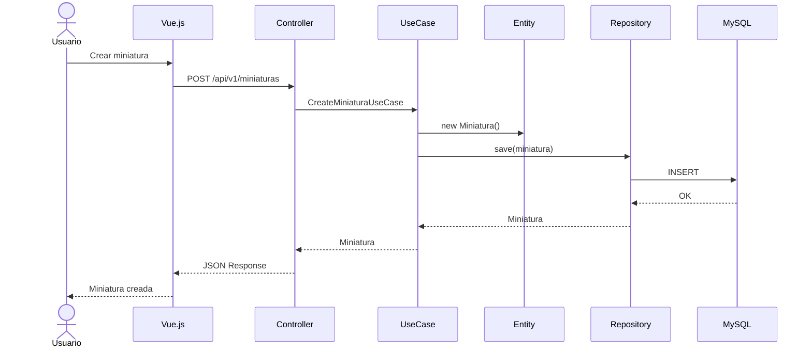

# Arquitectura del Sistema - HobbyPlanner

## Arquitectura Hexagonal (Ports & Adapters)


## Capas explicadas

| Capa | Responsabilidad | Ejemplo |
|------|-----------------|---------|
| **Domain** | Lógica de negocio pura, sin dependencias | `Miniatura`, `Proyecto`, `Email` (VO) |
| **Application** | Casos de uso, orquesta el dominio | `CreateMiniaturaUseCase` |
| **Infrastructure** | Detalles técnicos, implementaciones | `DoctrineMiniaturaRepository` |
| **Presentation** | Entrada/salida HTTP | `MiniaturaController` |

## Estructura de carpetas Backend


## Flujo de una petición


## Regla de dependencias
```
        ┌─────────────────┐
        │     Domain      │  ← No depende de NADA
        └─────────────────┘
                ▲
                │
        ┌─────────────────┐
        │   Application   │  ← Solo depende de Domain
        └─────────────────┘
                ▲
                │
        ┌─────────────────┐
        │ Infrastructure  │  ← Depende de Domain y Application
        └─────────────────┘
                ▲
                │
        ┌─────────────────┐
        │  Presentation   │  ← Depende de Application
        └─────────────────┘
```

**La clave:** El dominio es el núcleo y no conoce nada del exterior (ni base de datos, ni framework, ni HTTP).