# Arquitectura del Sistema - HobbyPlanner

## Arquitectura Hexagonal (Ports & Adapters)

```mermaid
graph TB
    subgraph External["🌐 EXTERNO"]
        FE[Vue.js Frontend]
        DB[(MySQL)]
    end

    subgraph Presentation["🎨 PRESENTATION LAYER"]
        CTRL[Controllers API]
    end

    subgraph Application["⚙️ APPLICATION LAYER"]
        UC_AUTH[Auth UseCases]
        UC_MINI[Miniatura UseCases]
        UC_UNIDAD[Unidad UseCases]
        UC_PROY[Proyecto UseCases]
        UC_PLAN[Planificacion UseCases]
    end

    subgraph Domain["💎 DOMAIN LAYER - Núcleo"]
        ENT[Entities]
        VO[Value Objects]
        REPO_INT[Repository Interfaces]
    end

    subgraph Infrastructure["🔧 INFRASTRUCTURE LAYER"]
        REPO_IMPL[Doctrine Repositories]
        JWT[JWT Security]
    end

    FE -->|HTTP/JSON| CTRL
    CTRL --> UC_AUTH
    CTRL --> UC_MINI
    CTRL --> UC_UNIDAD
    CTRL --> UC_PROY
    CTRL --> UC_PLAN
    
    UC_AUTH --> ENT
    UC_MINI --> ENT
    UC_UNIDAD --> ENT
    UC_PROY --> ENT
    UC_PLAN --> ENT
    
    UC_AUTH --> REPO_INT
    UC_MINI --> REPO_INT
    UC_UNIDAD --> REPO_INT
    UC_PROY --> REPO_INT
    UC_PLAN --> REPO_INT
    
    ENT --> VO
    
    REPO_INT -.->|implementa| REPO_IMPL
    REPO_IMPL --> DB
    CTRL --> JWT

    style Domain fill:#e3f2fd
    style Application fill:#fff8e1
    style Infrastructure fill:#fce4ec
    style Presentation fill:#e8f5e9
```


## Capas explicadas

| Capa | Responsabilidad | Ejemplo |
|------|-----------------|---------|
| **Domain** | Lógica de negocio pura | `Miniatura`, `Proyecto`, `Planificacion` |
| **Application** | Casos de uso | `CreateMiniaturaUseCase` |
| **Infrastructure** | Detalles técnicos | `DoctrineMiniaturaRepository` |
| **Presentation** | Entrada/salida HTTP | `MiniaturaController` |

## Estructura de carpetas
```
src/
├── Domain/
│   ├── Entity/
│   │   ├── Miniatura.php
│   │   ├── Unidad.php
│   │   ├── Proyecto.php
│   │   └── Planificacion.php
│   ├── Repository/
│   │   ├── MiniaturaRepositoryInterface.php
│   │   ├── UnidadRepositoryInterface.php
│   │   ├── ProyectoRepositoryInterface.php
│   │   └── PlanificacionRepositoryInterface.php
│   └── ValueObject/
│       ├── Email.php
│       └── NivelDetalle.php
│
├── Application/
│   └── UseCase/
│       ├── Miniatura/
│       │   ├── CreateMiniaturaUseCase.php
│       │   ├── UpdateMiniaturaUseCase.php
│       │   └── DeleteMiniaturaUseCase.php
│       ├── Unidad/
│       ├── Proyecto/
│       └── Planificacion/
│
└── Infrastructure/
    ├── Persistence/
    │   └── Doctrine/
    │       ├── DoctrineMiniaturaRepository.php
    │       ├── DoctrineUnidadRepository.php
    │       ├── DoctrineProyectoRepository.php
    │       └── DoctrinePlanificacionRepository.php
    └── Controller/
        └── Api/
            ├── MiniaturaController.php
            ├── UnidadController.php
            ├── ProyectoController.php
            └── PlanificacionController.php
```

## Flujo de una petición


## Regla de dependencias
```
        ┌─────────────────┐
        │     Domain      │  ← No depende de NADA
        └─────────────────┘
                ▲
                │
        ┌─────────────────┐
        │   Application   │  ← Solo depende de Domain
        └─────────────────┘
                ▲
                │
        ┌─────────────────┐
        │ Infrastructure  │  ← Depende de Domain y Application
        └─────────────────┘
                ▲
                │
        ┌─────────────────┐
        │  Presentation   │  ← Depende de Application
        └─────────────────┘
```
