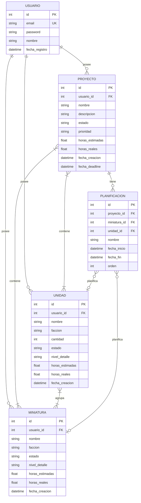

# Diagrama de Entidades - HobbyPlanner

## Modelo de Dominio

## Relaciones

| Relación | Tipo | Descripción |
|----------|------|-------------|
| Usuario → Proyecto | 1:N | Un usuario tiene muchos proyectos |
| Usuario → Miniatura | 1:N | Un usuario tiene muchas miniaturas |
| Usuario → Unidad | 1:N | Un usuario tiene muchas unidades |
| Proyecto ↔ Miniatura | N:M | Proyectos contienen miniaturas |
| Proyecto ↔ Unidad | N:M | Proyectos contienen unidades |
| Unidad ↔ Miniatura | N:M | Unidades agrupan miniaturas |
| Proyecto → Planificación | 1:N | Un proyecto tiene varias planificaciones |
| Planificación → Miniatura | N:1 | Opcional |
| Planificación → Unidad | N:1 | Opcional |

## Estados

**Miniatura / Unidad:**
- `PENDIENTE` - Sin empezar
- `EN_PROGRESO` - Pintando
- `COMPLETADA` - Terminada

**Proyecto:**
- `PENDIENTE` - Sin empezar
- `EN_PROGRESO` - Trabajando
- `COMPLETADO` - Finalizado

## Niveles de detalle

- `BASICO` - Imprimación + colores base
- `TABLETOP` - Listo para jugar
- `EXPOSICION` - Máximo detalle

## Campos opcionales

| Entidad | Campo | ¿Opcional? |
|---------|-------|------------|
| Planificación | miniatura_id | ✅ Sí |
| Planificación | unidad_id | ✅ Sí |
| Planificación | fecha_inicio | ✅ Sí |
| Planificación | fecha_fin | ✅ Sí |
| Proyecto | fecha_deadline | ✅ Sí |
