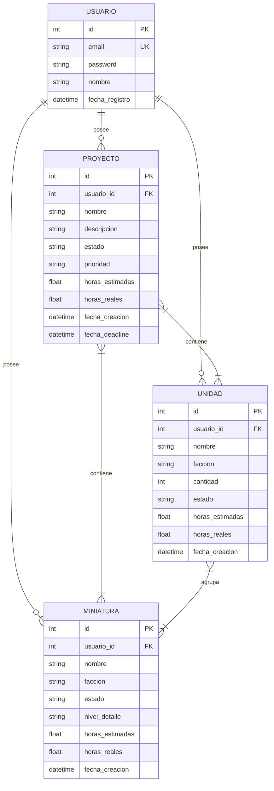

# Diagrama de Entidades - HobbyPlanner

## Modelo de Dominio

## Relaciones

| Relación | Tipo | Descripción |
|----------|------|-------------|
| Usuario → Proyecto | 1:N | Un usuario tiene muchos proyectos |
| Usuario → Miniatura | 1:N | Un usuario tiene muchas miniaturas |
| Usuario → Unidad | 1:N | Un usuario tiene muchas unidades |
| Proyecto ↔ Miniatura | N:M | Un proyecto puede tener varias minis y viceversa |
| Proyecto ↔ Unidad | N:M | Un proyecto puede tener varias unidades y viceversa |
| Unidad ↔ Miniatura | N:M | Una unidad agrupa varias minis y una mini puede estar en varias unidades |

## Estados posibles

**Miniatura / Unidad:**
- `PENDIENTE` - Sin empezar
- `EN_PROGRESO` - Pintando
- `COMPLETADA` - Terminada

**Proyecto:**
- `PENDIENTE` - Sin empezar
- `EN_PROGRESO` - Trabajando
- `COMPLETADO` - Finalizado

## Niveles de detalle (Miniatura)

- `BASICO` - Imprimación + colores base
- `TABLETOP` - Listo para jugar
- `EXPOSICION` - Máximo detalle