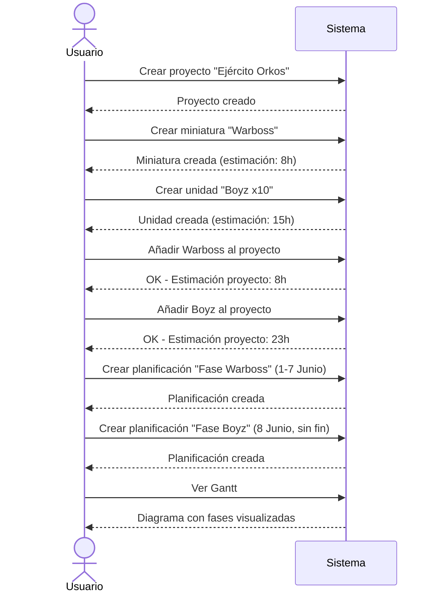
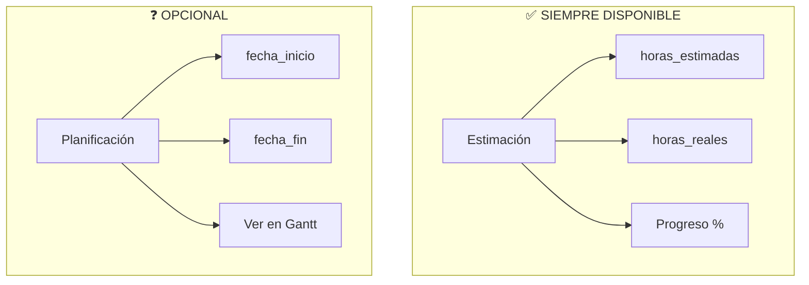

# Casos de Uso - HobbyPlanner

## Diagrama General

```mermaid
graph LR
    subgraph Usuario
        U((Usuario))
    end

    subgraph Autenticación
        UC1[Registrarse]
        UC2[Iniciar sesión]
        UC3[Cerrar sesión]
        UC4[Ver perfil]
        UC5[Editar perfil]
    end

    subgraph Miniaturas
        UC6[Listar miniaturas]
        UC7[Crear miniatura]
        UC8[Ver miniatura]
        UC9[Editar miniatura]
        UC10[Eliminar miniatura]
        UC11[Completar miniatura]
    end

    subgraph Unidades
        UC12[Listar unidades]
        UC13[Crear unidad]
        UC14[Ver unidad]
        UC15[Editar unidad]
        UC16[Eliminar unidad]
        UC17[Añadir minis a unidad]
        UC18[Quitar minis de unidad]
    end

    subgraph Proyectos
        UC19[Listar proyectos]
        UC20[Crear proyecto]
        UC21[Ver proyecto]
        UC22[Editar proyecto]
        UC23[Eliminar proyecto]
        UC24[Añadir minis/unidades]
        UC25[Completar proyecto]
    end

    subgraph Planificación
        UC26[Crear planificación]
        UC27[Editar planificación]
        UC28[Eliminar planificación]
        UC29[Ver Gantt]
    end

    U --> UC1
    U --> UC2
    U --> UC3
    U --> UC4
    U --> UC5
    U --> UC6
    U --> UC7
    U --> UC8
    U --> UC9
    U --> UC10
    U --> UC11
    U --> UC12
    U --> UC13
    U --> UC14
    U --> UC15
    U --> UC16
    U --> UC17
    U --> UC18
    U --> UC19
    U --> UC20
    U --> UC21
    U --> UC22
    U --> UC23
    U --> UC24
    U --> UC25
    U --> UC26
    U --> UC27
    U --> UC28
    U --> UC29
```

## Flujo: Crear proyecto con planificación

## Estimación vs Planificación

## Tabla resumen

| Módulo | Casos de uso |
|--------|--------------|
| **Auth** | Registro, Login, Logout, Perfil |
| **Miniaturas** | CRUD + Completar |
| **Unidades** | CRUD + Gestionar minis |
| **Proyectos** | CRUD + Añadir contenido + Completar |
| **Planificación** | CRUD + Ver Gantt |
