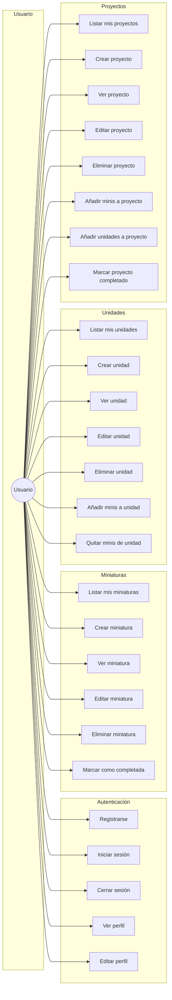
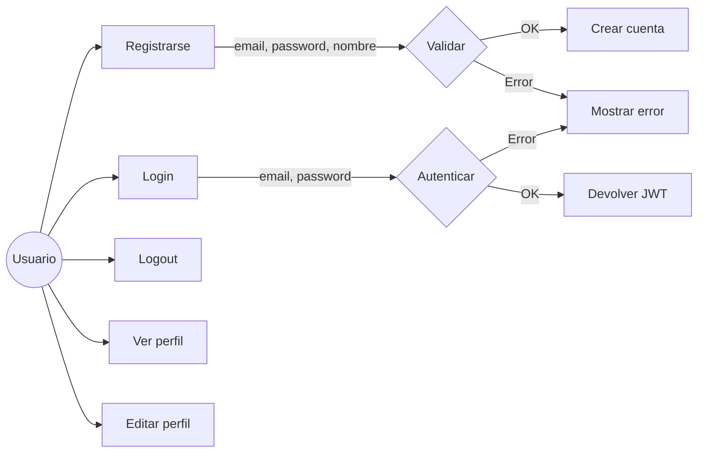
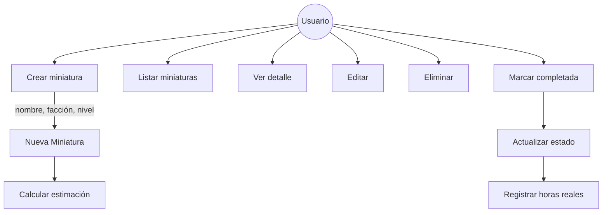
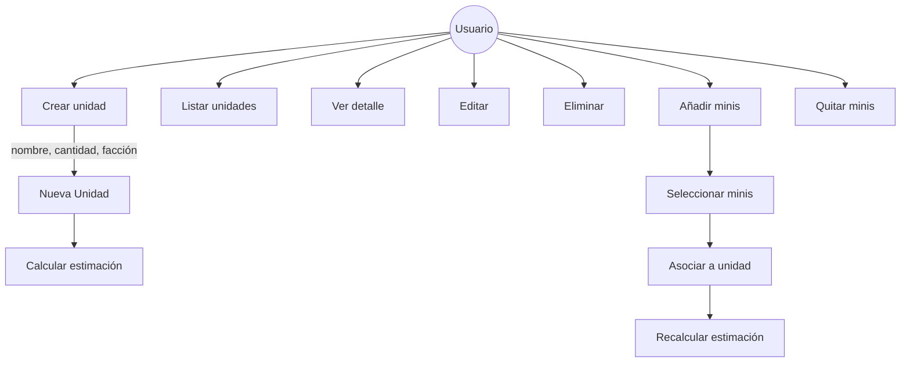
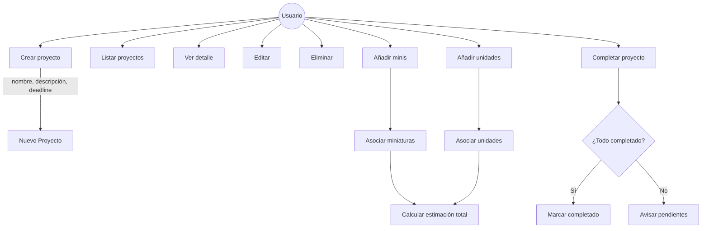
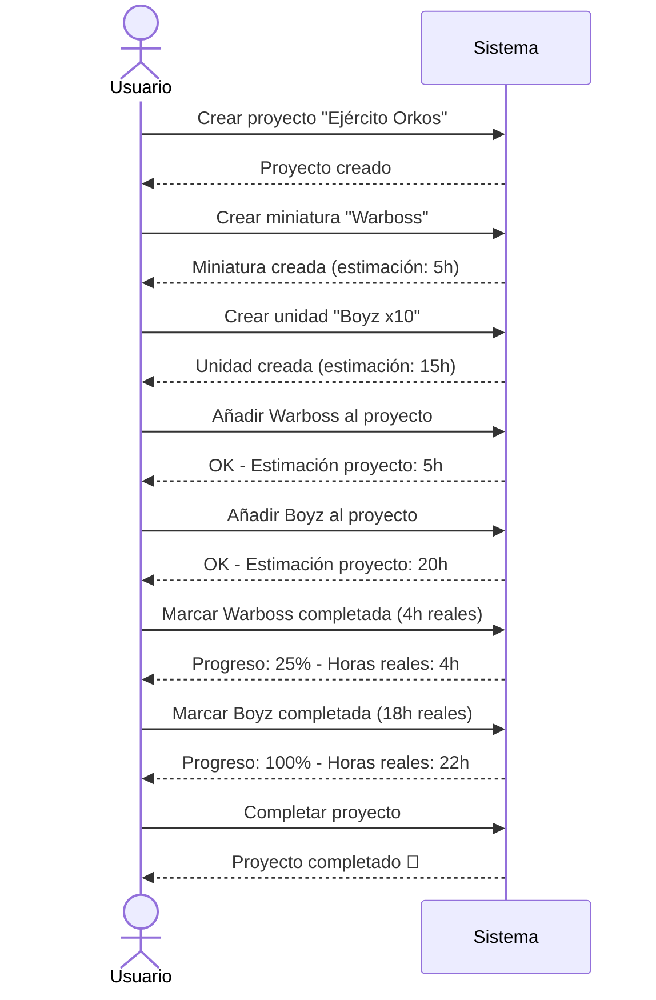

# Casos de Uso - HobbyPlanner

## Diagrama General

## Detalle por módulo

### Autenticación

### Miniaturas

### Unidades

### Proyectos

## Flujo: Crear proyecto completo

## Tabla resumen

| Módulo | Casos de uso |
|--------|--------------|
| **Auth** | Registro, Login, Logout, Ver perfil, Editar perfil |
| **Miniaturas** | CRUD + Completar |
| **Unidades** | CRUD + Añadir/Quitar minis |
| **Proyectos** | CRUD + Añadir minis/unidades + Completar |